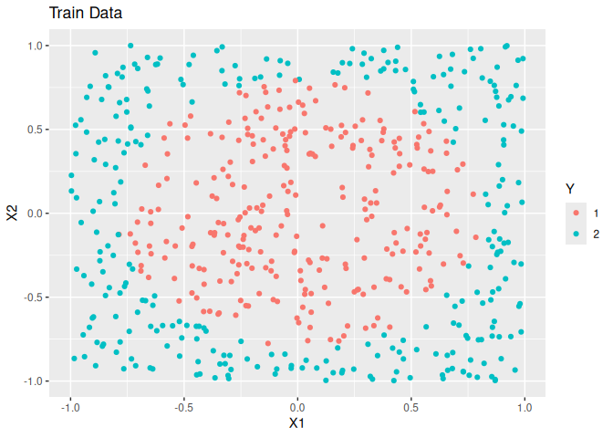

## Package Introduction

<!-- badges: start -->

[](https://github.com/gmcmacran/tidydann/actions/workflows/R-CMD-check.yaml)
[](https://app.codecov.io/gh/gmcmacran/tidydann?branch=main)
[](https://cran.r-project.org/package=tidydann)
<!-- badges: end -->

In k nearest neighbors, the shape of the neighborhood is usually
circular. Discriminant Adaptive Nearest Neighbor (dann) is a variation
of k nearest neighbors where the shape of the neighborhood is data
driven. The neighborhood is elongated along class boundaries and shrunk
in the orthogonal direction. See [Discriminate Adaptive Nearest Neighbor
Classification](https://web.stanford.edu/~hastie/Papers/dann_IEEE.pdf)
by Hastie and Tibshirani.

This package brings the [dann](https://CRAN.R-project.org/package=dann)
package into the tidymodels ecosystem.

Models:

- tidy_dann
- tidy_sub_dann

## Example 1: fit and predict with tidy dann

Arguments:

- neighbors - The number of points in the neighborhood.
- neighborhood - The number of data points used to estimate a good shape
  for the neighborhood.
- epsilon - Softening parameter.

In this example, simulated data is made. The overall trend is a circle
inside a square.

``` r
library(parsnip)
library(rsample)
library(scales)
library(dials)
library(tune)
library(yardstick)
library(workflows)
library(tidydann)
library(dplyr, warn.conflicts = FALSE)
library(ggplot2)
library(mlbench)

# Create training data
set.seed(1)
circle_data <- mlbench.circle(700, 2) |>
  tibble::as_tibble()
colnames(circle_data) <- c("X1", "X2", "Y")

set.seed(42)
split <- initial_split(circle_data, prop = .80)
train <- training(split)
test <- testing(split)

ggplot(train, aes(x = X1, y = X2, colour = as.factor(Y))) +
  geom_point() +
  labs(title = "Train Data", colour = "Y")
```



AUC is nearly perfect for these data.

``` r
model <- tidy_dann(neighbors = 5, neighborhood = 50, epsilon = 1) |>
  set_engine("dann") |>
  fit(formula = Y ~ X1 + X2, data = train)

testPredictions <- model |>
  predict(new_data = test, type = "prob")
testnPredictions <- test |>
  select(Y) |>
  bind_cols(testPredictions)

testnPredictions |>
  roc_auc(truth = Y, event_level = "first", .pred_1)
#> # A tibble: 1 × 3
#>   .metric .estimator .estimate
#>   <chr>   <chr>          <dbl>
#> 1 roc_auc binary         0.991
```

## Example 2: cross validation with tidy sub dann

In general, tidy_dann will struggle as unrelated variables are
intermingled with informative variables. To deal with this,
tidy_sub_dann projects the data onto a unique subspace and then calls
dann on the subspace. In the below example there are 2 related variables
and 5 that are unrelated.

``` r
######################
# Circle data with unrelated variables
######################
# Create training data
set.seed(1)
circle_data <- mlbench.circle(700, 2) |>
  tibble::as_tibble()
colnames(circle_data) <- c("X1", "X2", "Y")

# Add 5 unrelated variables
circle_data <- circle_data |>
  mutate(
    U1 = runif(700, -1, 1),
    U2 = runif(700, -1, 1),
    U3 = runif(700, -1, 1),
    U4 = runif(700, -1, 1),
    U5 = runif(700, -1, 1)
  )

set.seed(42)
split <- initial_split(circle_data, prop = .80)
train <- training(split)
test <- testing(split)
```

Without careful feature selection, tidy_dann’s performance suffers.

``` r
model <- tidy_dann(neighbors = 5, neighborhood = 50, epsilon = 1) |>
  set_engine("dann") |>
  fit(formula = Y ~ ., data = train)

testPredictions <- model |>
  predict(new_data = test, type = "prob")
testnPredictions <- test |>
  select(Y) |>
  bind_cols(testPredictions)

testnPredictions |>
  roc_auc(truth = Y, event_level = "first", .pred_1)
#> # A tibble: 1 × 3
#>   .metric .estimator .estimate
#>   <chr>   <chr>          <dbl>
#> 1 roc_auc binary         0.759
```

To deal with uninformative variables, a tidy_sub_dann model with tuned
parameters is trained.

``` r
# define workflow
sub_dann_spec <-
  tidy_sub_dann(
    neighbors = tune(),
    neighborhood = tune(),
    epsilon = tune(),
    weighted = tune(),
    sphere = tune(),
    num_comp = tune()
  ) |>
  set_engine("sub_dann") |>
  set_mode("classification")

sub_dann_wf <- workflow() |>
  add_model(sub_dann_spec) |>
  add_formula(Y ~ .)

# define grid
set.seed(2)
finalized_neighborhood <- neighborhood() |> get_p(train[-1])
finalized_num_comp <- num_comp() |> get_p(train[-1])
grid <- grid_random(
  neighbors(),
  finalized_neighborhood,
  epsilon(),
  weighted(),
  sphere(),
  finalized_num_comp,
  size = 30,
  filter = neighbors <= neighborhood
)

# tune
set.seed(123)
cv <- vfold_cv(data = train, v = 5)
sub_dann_tune_res <- sub_dann_wf |>
  tune_grid(resamples = cv, grid = grid)
best_model <- sub_dann_tune_res |>
  select_best(metric = "roc_auc")
```

With the best hyperparameters found, a final model on all training data
is fit. Test AUC improved.

``` r
# retrain on all data
final_model <-
  sub_dann_wf |>
  finalize_workflow(best_model) |>
  last_fit(split)

final_model |>
  collect_metrics() |>
  filter(.metric == "roc_auc") |>
  select(.metric, .estimator, .estimate)
#> # A tibble: 1 × 3
#>   .metric .estimator .estimate
#>   <chr>   <chr>          <dbl>
#> 1 roc_auc binary         0.946
```
